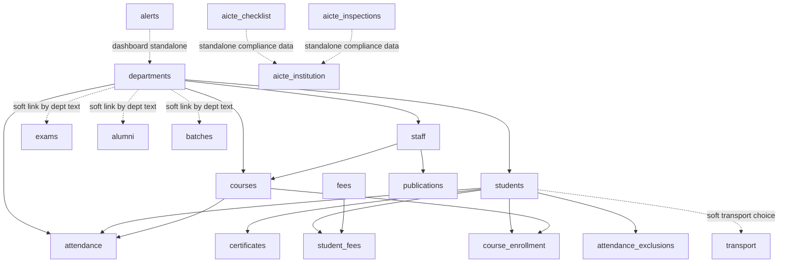
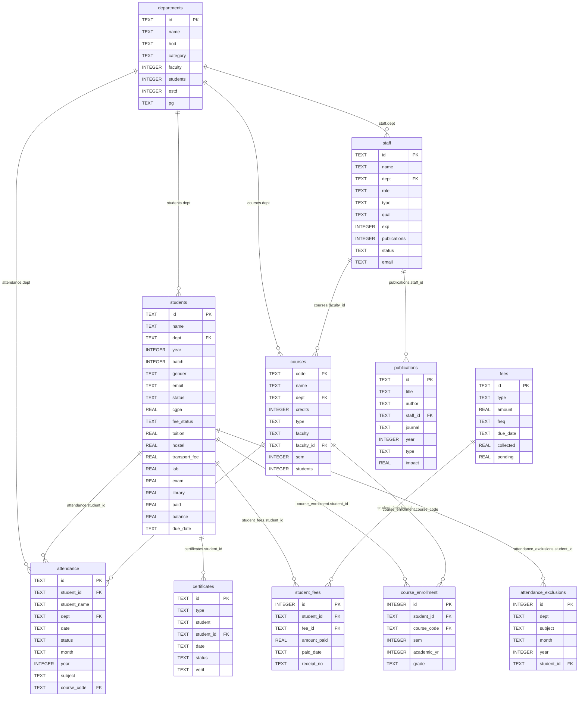
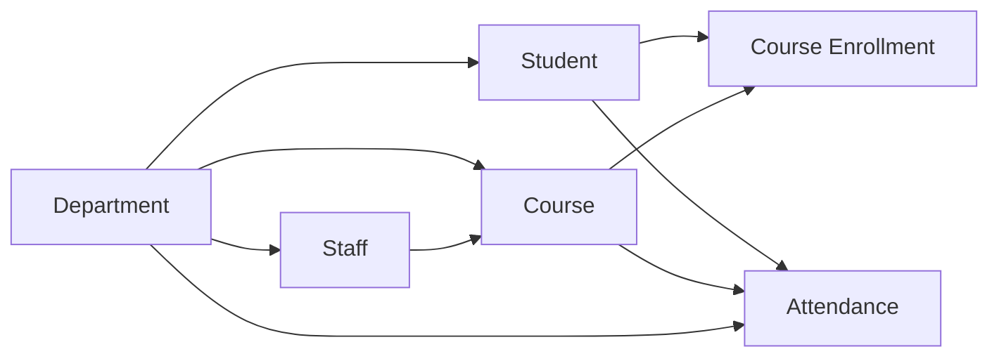
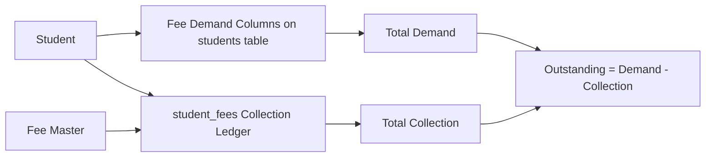

# College ERP Database Relationship Architecture

Generated on: 2026-05-04

## Verification Result

The current SQLite database was checked with:

```sql
PRAGMA foreign_key_check;
```

Result:

```text
No broken foreign key records found.
```

So the currently enforced database relations are valid.

Important note: some modules are intentionally connected by application logic only, not by strict database foreign keys. This is acceptable for demo/pilot use, but before production deployment those soft links should be hardened.

## High-Level Architecture



## Entity Relationship Diagram



## Actual Enforced Foreign Keys

| Child Table | Child Column | Parent Table | Parent Column | Delete Rule | Meaning |
|---|---|---|---|---|---|
| `students` | `dept` | `departments` | `id` | `RESTRICT` | A student must belong to a valid department |
| `staff` | `dept` | `departments` | `id` | `SET NULL` | Staff can belong to a department |
| `courses` | `dept` | `departments` | `id` | `RESTRICT` | A course must belong to a valid department |
| `courses` | `faculty_id` | `staff` | `id` | `SET NULL` | A course can be assigned to a staff member |
| `attendance` | `student_id` | `students` | `id` | `CASCADE` | Attendance belongs to a student |
| `attendance` | `dept` | `departments` | `id` | `RESTRICT` | Attendance is linked to a department |
| `attendance` | `course_code` | `courses` | `code` | `SET NULL` | Attendance can be linked to a course |
| `certificates` | `student_id` | `students` | `id` | `RESTRICT` | Certificates belong to students |
| `publications` | `staff_id` | `staff` | `id` | `SET NULL` | Publications can be linked to staff |
| `student_fees` | `student_id` | `students` | `id` | `CASCADE` | Fee collection ledger belongs to student |
| `student_fees` | `fee_id` | `fees` | `id` | `RESTRICT` | Fee collection row belongs to fee head |
| `course_enrollment` | `student_id` | `students` | `id` | `CASCADE` | Enrollment belongs to student |
| `course_enrollment` | `course_code` | `courses` | `code` | `CASCADE` | Enrollment belongs to course |
| `attendance_exclusions` | `student_id` | `students` | `id` | `CASCADE` | Attendance sheet exclusion belongs to student |

## Section-by-Section Relationship Status

| Section | Relationship Status | Notes |
|---|---|---|
| Dashboard | Good | Reads live counts from multiple tables |
| Students | Good | Hard FK to departments; connected to attendance, fees, certificates, enrollments |
| Staff | Good | Hard FK to departments; connected to courses and publications |
| Departments | Good | Parent table for students, staff, courses, attendance |
| Courses | Good | Hard FK to departments and staff; linked to attendance and enrollments |
| Attendance | Good | Hard FK to students/departments/courses; report generation is database-backed |
| Fees | Good for demo/pilot | `student_fees` stores collection ledger; fee demand is currently stored in student fee component columns |
| Examinations | Soft link | `exams.dept` is text because it can be `"All"`; production can use a junction table |
| Alumni | Soft link | `alumni.dept` is text; production should add FK to departments |
| Batches | Soft link | `batches.dept` is text; production should add FK to departments or derive from students |
| Transport | Soft link | Student transport is stored as text; production should add route FK |
| Alerts | Standalone | OK as dashboard notification data |
| AICTE | Standalone/compliance | OK for compliance records, not strongly tied to core academic tables |
| Certificates | Good | Hard FK to students through `student_id` |
| Publications | Good | Hard FK to staff through `staff_id` |

## Core Academic Flow



## Fee Flow



For the current demo/pilot:

```text
Total Demand = tuition + hostel + transport_fee + lab + exam + library + sports
             + development + admission + alumni_fee + medical + placement
             + it_infra + miscellaneous

Total Collection = sum(student_fees.amount_paid) or student paid/collection field

Outstanding = max(Total Demand - Total Collection, 0)
```

For production, a cleaner accounting model would split demand and payment into separate tables:

```text
student_fee_demands
student_fee_payments
student_fee_receipts
```

## Production Hardening Recommendations

The current schema is safe for demo and pilot use. Before production, improve these areas:

1. Add `hod_staff_id` to `departments` and reference `staff.id`.
2. Add `department_id` FK to `alumni`.
3. Add `department_id` FK to `batches`, or generate batches directly from students.
4. Replace `exams.dept = "All"` with an `exam_departments` junction table.
5. Add `transport_route_id` to students and reference `transport.id`.
6. Make attendance always store `course_code`, not only subject text.
7. Move fee demand into a dedicated `student_fee_demands` table.
8. Move fee payments into a dedicated `student_fee_payments` table with receipt numbers and payment mode.
9. Add audit tables for create/edit/delete/import/export actions.
10. Add production user/role tables instead of in-memory demo users.

## Conclusion

The enforced table relations are currently valid. The main academic, staff, course, attendance, certificate, publication, fee, and enrollment relationships are correctly connected with foreign keys.

For demo and client presentation, the database structure is acceptable.

For final production sale, the schema should be hardened by converting the remaining soft links into strict foreign keys or junction tables.

