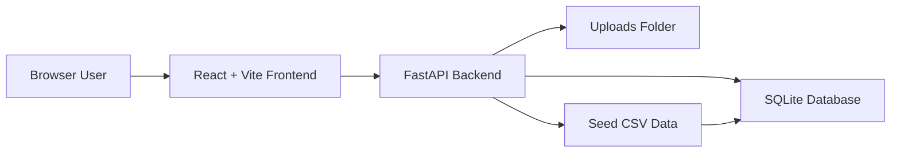
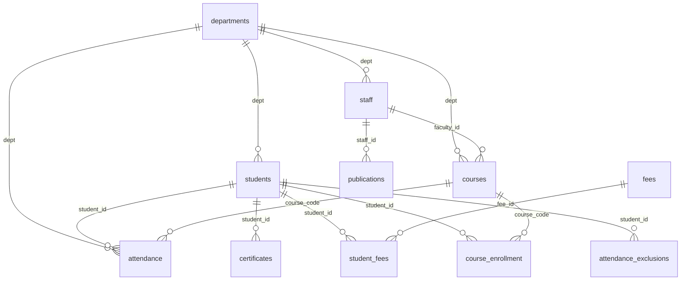

# Vidyasagar University ERP - Project Documentation

Generated on: 2026-05-03

## 1. Executive Summary

The Vidyasagar University ERP is a web-based college administration system built for managing academic, administrative, finance, attendance, examination, compliance, and reporting workflows from one dashboard.

The current product is suitable for a client-facing demo and pilot implementation. It has real frontend-backend-database connectivity, SQLite persistence, live dashboards, CRUD screens, import/export support, fee calculations, attendance reports, alerts, and demo deployment preparation.

For full production sale to a university, the recommended next step is a hardening phase covering production authentication, role-based authorization, PostgreSQL migration, backups, audit logs, automated testing, and SLA/support processes.

## 2. Technology Stack

| Layer | Technology | Purpose |
|---|---|---|
| Frontend | React 19, Vite | Browser application and admin UI |
| Backend | FastAPI, Pydantic | REST API and business logic |
| Database | SQLite | Demo/pilot persistent database |
| Data Seed | CSV files | Clean demo data and database rebuild |
| Deployment | Vercel frontend, Render/Railway backend | Recommended split deployment |
| Storage | Local filesystem or mounted persistent disk | SQLite DB and uploads |

## 3. Repository Layout

```text
CollegeERP/
  DEPLOYMENT.md
  PROJECT_DOCUMENTATION.md
  COST_ESTIMATION_AND_QUOTE.md
  erp_database_schema_erd.html
  backend/
    main.py
    erp_db_setup.py
    prepare_demo_db.py
    requirements.txt
    data/
      students.csv
      staff.csv
      courses.csv
      attendance.csv
      fees.csv
      alumni.csv
      alerts.csv
      ...
  college-erp/
    package.json
    src/
      api.js
      App.jsx
      CollegeERP.jsx
      LoginPage.jsx
      ReportModal.jsx
      main.jsx
```

## 4. System Architecture



### Runtime Flow

1. User logs in from the React frontend.
2. The frontend stores the session token in local storage and cookie fallback.
3. All module reads/writes go through `college-erp/src/api.js`.
4. FastAPI validates request payloads through Pydantic models.
5. Business logic writes to SQLite using transaction-safe helpers.
6. Dashboard and reports read live data from the database.

## 5. Main Functional Modules

### 5.1 Authentication

Current implementation:

- Demo users are defined in `backend/main.py`.
- Login returns a generated token.
- Active tokens are stored in memory.
- Frontend stores token and user details using local storage plus cookie fallback.

Demo roles:

| Username | Role |
|---|---|
| admin | Admin |
| hod | HOD |
| teacher | Teaching Staff |
| support | Support Staff |
| examctrl | Exam Controller |

Production requirement:

- Replace in-memory demo authentication with database-backed users.
- Add hashed passwords, JWT/session expiry, role-based access control, password reset, and audit logs.

### 5.2 Dashboard

Dashboard data is served from `/analytics/dashboard`.

It reads live database values for:

- Total students
- Active students
- Staff count
- Department count
- Course count
- Fee collection and pending amount
- Attendance summary
- Exams and reports overview

### 5.3 Departments

Departments are stored in the `departments` table.

Key behavior:

- Academic and administrative departments are separated.
- New departments are available across student, staff, course, department, and attendance dropdowns.
- Student and faculty counts are recalculated from live records.

### 5.4 Students

Students are stored in the `students` table.

Key behavior:

- Student IDs can be supplied or auto-generated.
- Batch field is part of add/edit workflows.
- Department dropdown is live from the database.
- Fee fields are stored per student.
- New students are automatically given fee ledger rows.
- New students are automatically enrolled into matching core department courses.
- Student records can be imported and exported.

### 5.5 Staff

Staff are stored in the `staff` table.

Key behavior:

- Staff IDs can be supplied or auto-generated.
- Teaching and support staff are supported.
- Department dropdown is live from the database.
- Staff counts sync back to departments.
- Staff can be associated with courses and publications.

### 5.6 Courses

Courses are stored in the `courses` table.

Key behavior:

- Courses belong to departments.
- Faculty can be linked by staff ID.
- Newly added courses become available in attendance subject selection.
- Course enrollment counts are maintained through the `course_enrollment` junction table.

### 5.7 Attendance

Attendance is stored in the `attendance` table.

Key behavior:

- Attendance records are saved to the backend.
- Subjects come from course data.
- Attendance supports present, absent, and holiday status.
- Attendance reports are generated only from saved database records.
- Removed students from a sheet are tracked in `attendance_exclusions`.

### 5.8 Fees

Fees use a ledger-style calculation.

Fee master heads:

- Tuition Fee
- Hostel Fee
- Transport Fee
- Lab Fee
- Exam Fee
- Library Fee
- Sports Fee
- Development Fee
- Admission Fee
- Alumni Fee
- Medical Fee
- Placement Fee
- IT Infrastructure Fee
- Miscellaneous Fee

Calculation method:

```text
Student Demand = sum(all fee component amounts)
Student Collection = sum(all payment collections)
Student Outstanding = max(Student Demand - Student Collection, 0)
```

Example:

```text
Tuition demand: 125000
Tuition collection: 90000
Tuition outstanding: 35000

Hostel demand: 65000
Hostel collection: 60000
Hostel outstanding: 5000

Total demand: 190000
Total collection: 150000
Total outstanding: 40000
```

Financial report method:

```text
Total Receivable = sum(student demand)
Total Collected = sum(student collection)
Total Pending = Total Receivable - Total Collected
Recovery Percentage = Total Collected / Total Receivable * 100
```

### 5.9 Examinations

Exams are stored in the `exams` table.

Key behavior:

- Exam IDs can be supplied or auto-generated.
- Exam type, department, date, status, total students, and hall ticket status are tracked.
- Exam reports summarize type distribution, completed/upcoming exams, hall tickets, and student CGPA bands.

### 5.10 Alumni

Alumni are stored in the `alumni` table.

Key behavior:

- Alumni records persist after refresh.
- Alumni can be created, edited, and deleted.
- Alumni imports are seeded through CSV for demo data.

### 5.11 Batches

Batches are stored in the `batches` table.

Key behavior:

- Batch year dropdown is supported.
- Batch records include department, student count, and mentor.
- Batch summary can be derived from live student records.

### 5.12 Alerts

Alerts are stored in the `alerts` table.

Key behavior:

- Alerts are backend-backed.
- Alerts can be added, edited, and deleted.
- Dashboard alert UI reads live alert records.

### 5.13 Reports

Reports are generated from backend endpoints:

| Report | Endpoint | Source Data |
|---|---|---|
| Student Analytics | `/reports/student-analytics` | students |
| Financial | `/reports/financial` | students, fees, student_fees |
| Exam Results | `/reports/exam-results` | exams, students |
| Attendance | `/reports/attendance` | attendance |
| Research | `/reports/research` | publications |
| AICTE | `/reports/aicte` | students, staff, publications, AICTE tables |

### 5.14 Import and Export

Export endpoint:

```text
GET /export/{section}
```

Upload endpoint:

```text
POST /upload/{section}
```

Supported approach:

- CSV-style parsing.
- IDs can be accepted from input or generated.
- Database constraints protect relationships.
- Imports should be tested with real client sample files before production rollout.

## 6. Database Architecture

### 6.1 Core Tables

| Table | Purpose |
|---|---|
| `departments` | Academic and administrative department master |
| `students` | Student master with academic and fee fields |
| `staff` | Teaching and support staff master |
| `courses` | Course catalog |
| `attendance` | Saved attendance records |
| `exams` | Examination schedule and status |
| `fees` | Institution-level fee heads |
| `student_fees` | Per-student fee collection ledger |
| `course_enrollment` | Student-course junction table |
| `attendance_exclusions` | Students hidden from specific attendance sheets |
| `certificates` | Student certificate records |
| `publications` | Staff research output |
| `transport` | Transport routes |
| `batches` | Batch/year summary records |
| `alumni` | Alumni records |
| `alerts` | Dashboard alerts |
| `aicte_checklist` | AICTE compliance checklist |
| `aicte_inspections` | AICTE inspection timeline |
| `aicte_institution` | Institution profile values |

### 6.2 Key Relationships



### 6.3 Important Constraints

- `students.dept` references `departments.id`.
- `staff.dept` references `departments.id`.
- `courses.dept` references `departments.id`.
- `courses.faculty_id` references `staff.id`.
- `attendance.student_id` references `students.id`.
- `attendance.course_code` references `courses.code`.
- `certificates.student_id` references `students.id`.
- `publications.staff_id` references `staff.id`.
- `student_fees.student_id` references `students.id`.
- `student_fees.fee_id` references `fees.id`.
- `course_enrollment.student_id` references `students.id`.
- `course_enrollment.course_code` references `courses.code`.

## 7. Backend API Overview

| Area | Endpoints |
|---|---|
| Health | `GET /`, `GET /health` |
| Auth | `POST /auth/login`, `POST /auth/logout`, `GET /auth/me` |
| Dashboard | `GET /analytics/dashboard` |
| Students | `GET/POST /students`, `GET/PUT/DELETE /students/{id}`, `GET /students/batches` |
| Alumni | `GET/POST /alumni`, `PUT/DELETE /alumni/{id}` |
| Staff | `GET/POST /staff`, `PUT/DELETE /staff/{id}` |
| Departments | `GET/POST /departments`, `PUT/DELETE /departments/{id}` |
| Courses | `GET/POST /courses`, `PUT/DELETE /courses/{code}` |
| Exams | `GET/POST /exams`, `PUT/DELETE /exams/{id}` |
| Fees | `GET/POST /fees`, `PUT/DELETE /fees/{id}`, `GET /fees/student-details` |
| Transport | `GET/POST /transport`, `PUT/DELETE /transport/{id}` |
| Attendance | `GET /attendance`, `GET /attendance/summary`, `POST /attendance`, `POST /attendance/bulk`, `DELETE /attendance/{student_id}` |
| Certificates | `GET/POST /certificates`, `PUT/DELETE /certificates/{id}` |
| Publications | `GET/POST /publications`, `PUT/DELETE /publications/{id}` |
| AICTE | `GET/POST/PUT/DELETE /aicte/checklist`, `GET/POST /aicte/inspections`, `GET /aicte/institution` |
| Batches | `GET/POST /batches`, `PUT/DELETE /batches/{id}` |
| Alerts | `GET/POST /alerts`, `PUT/DELETE /alerts/{id}` |
| Reports | `/reports/student-analytics`, `/reports/financial`, `/reports/exam-results`, `/reports/attendance`, `/reports/research`, `/reports/aicte` |
| Data | `GET /export/{section}`, `POST /upload/{section}` |
| Demo Seed | `POST /seed` when explicitly enabled |

## 8. Local Development Setup

### 8.1 Backend

```bash
cd backend
python3 -m venv .venv
source .venv/bin/activate
pip install -r requirements.txt
python3 erp_db_setup.py
uvicorn main:app --reload --port 8000
```

Backend URL:

```text
http://localhost:8000
```

Health check:

```text
http://localhost:8000/health
```

### 8.2 Frontend

```bash
cd college-erp
npm install
npm run dev
```

Frontend URL:

```text
http://localhost:5173
```

### 8.3 Frontend Environment

Create `college-erp/.env` from `college-erp/.env.example`.

```env
VITE_API_BASE_URL=http://localhost:8000
VITE_DEMO_MODE=true
```

### 8.4 Backend Environment

Create `backend/.env` from `backend/.env.example`.

```env
ALLOWED_ORIGINS=http://localhost:5173
SQLITE_PATH=/absolute/path/to/erp_university.db
UPLOADS_PATH=/absolute/path/to/uploads
ERP_DEMO_MODE=true
ENABLE_RESEED_ROUTE=false
```

## 9. Demo Database Preparation

Before showing to a client:

```bash
cd backend
python3 prepare_demo_db.py
```

This script:

- Backs up the current SQLite database.
- Rebuilds a clean demo database from CSV seed data.
- Seeds students, staff, departments, courses, attendance, fees, alumni, alerts, AICTE data, and related tables.
- Backfills course enrollments.
- Syncs fee balances.

## 10. Deployment Plan

Recommended deployment:

| Component | Platform | Reason |
|---|---|---|
| Frontend | Vercel | Vite static frontend support |
| Backend | Render or Railway | Long-running FastAPI service with persistent storage |
| Database | SQLite on persistent disk for demo, PostgreSQL for production | Persistence and safer deployment model |
| Uploads | Persistent disk or object storage | Avoid losing uploaded files |

Do not deploy the current SQLite-writing backend as serverless-only Vercel Functions for production. The backend writes to SQLite and local uploads, so it needs persistent storage or a production database.

Useful references:

- Vercel Vite deployment: https://vercel.com/docs/frameworks/frontend/vite
- Vercel FastAPI framework notes: https://vercel.com/docs/frameworks/backend/fastapi
- Vercel Functions runtime: https://vercel.com/docs/functions/runtimes
- Render persistent disks: https://render.com/docs/disks
- Railway volumes: https://docs.railway.com/volumes

## 11. Production Readiness Checklist

Before selling as a production ERP, complete the following:

| Area | Required Work |
|---|---|
| Authentication | Database users, hashed passwords, secure sessions/JWT |
| Authorization | Role-based access per module and action |
| Database | Move from SQLite to PostgreSQL for multi-user production |
| Backups | Daily automated database backups and restore process |
| Audit Logs | Track who created, edited, deleted, imported, and exported data |
| Testing | API tests, frontend smoke tests, import tests, report tests |
| Linting | Resolve existing React lint errors before production delivery |
| Security | CORS allowlist, secret management, HTTPS, rate limiting |
| Data Migration | Client sample import validation and mapping rules |
| Observability | Error logging, uptime monitor, health checks |
| Documentation | Admin guide, user guide, deployment guide, support SOP |
| Legal | SLA, warranty, AMC, data protection responsibility |

## 12. Current Demo Status

The application is appropriate for a controlled demo if:

- Demo database is rebuilt before presentation.
- Demo login credentials are prepared.
- Internet and backend hosting are checked before the session.
- Browser local storage is cleared only after confirming backend persistence.
- The demo flow is rehearsed across dashboard, students, fees, attendance, reports, alerts, and imports.

Known production gaps:

- Authentication is demo-level.
- Tokens are in-memory.
- SQLite is not ideal for multi-campus production scale.
- Lint issues still need cleanup.
- No full automated regression suite is present.
- Upload storage should move to persistent/object storage for production.

## 13. Suggested Roadmap

### Phase 1 - Client Demo and Pilot

- Deploy frontend and backend.
- Seed clean client-facing data.
- Prepare demo accounts.
- Run through complete workflow.
- Collect client requirements.

### Phase 2 - Production Hardening

- PostgreSQL migration.
- Secure authentication and role permissions.
- Audit logs.
- Automated backup.
- Test suite.
- Import mapping for real client data.

### Phase 3 - University Rollout

- Department-wise onboarding.
- Data migration.
- User training.
- Report customization.
- Payment/SMS/email integrations if required.
- AMC and support process.

## 14. Client Demo Script

Recommended order:

1. Login as admin.
2. Show dashboard live counts.
3. Add a department and show it in student/staff/course/attendance dropdowns.
4. Add a student with batch and fee fields.
5. Demonstrate fee demand, collection, and outstanding calculation.
6. Add a course and show it in attendance.
7. Mark attendance and generate the attendance report.
8. Show financial report.
9. Add/edit dashboard alert.
10. Export a section.
11. Explain deployment and production hardening plan.

